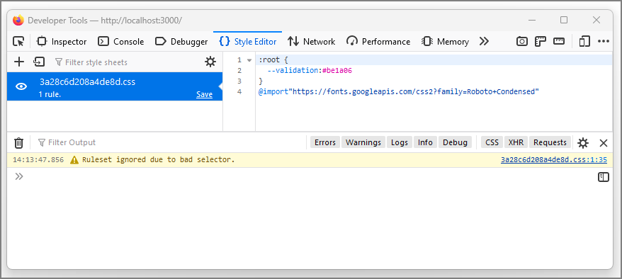

# Next.js SCSS Bundling Bugs

This repository reproduces two bugs with Next.js + SCSS bundling when creating an optimised production build (bugs are
not present when running in dev mode). Configuring `swcMinify: false` does not make a difference.

Only one bug manifests at a time, seemingly at random; rebuilding and re-running the production server repeatedly
results in different outcomes.

The first bug has been reproduced using a private repository with version `13.4.7`, version `13.4.12`, and
version `13.4.19` of Next.js.

Both bugs can been replicated using this repository with any of the following versions of Next.js:

- `13.4.19`
- `13.4.20-canary.16`

Additionally, the first bug can been replicated using this repository with any of the following versions of Next.js:

- `14.2.24`
- `15.2.1`
- `15.2.2-canary.0`

I cannot be certain whether the second bug is actually fixed in Next.js 14+, given it was always inconsistent to
reproduce, and the rarer bug of the two.

[//]: # (@formatter:off)
<!-- TOC -->
* [Next.js SCSS Bundling Bugs](#nextjs-scss-bundling-bugs)
  * [Reproduction](#reproduction)
    * [Observed criteria](#observed-criteria)
  * [Issues](#issues)
    * [1. Trailing semicolon (`;`) stripped before bundling, breaking `@import` and following bundled rule](#1-trailing-semicolon--stripped-before-bundling-breaking-import-and-following-bundled-rule)
    * [2. In-JavaScript `import`s of SCSS files re-ordered, resulting in bundled `@import` not being first in chunk](#2-in-javascript-imports-of-scss-files-re-ordered-resulting-in-bundled-import-not-being-first-in-chunk)
<!-- TOC -->
[//]: # (@formatter:on)

## Reproduction

1. Clone this repository
2. Execute `npm install`
3. Execute `npm run build`
4. Execute `npm run start`
5. Navigate to [`http://localhost:3000`]
6. _Observe that one of the two documented issues have occurred_ (in both cases, the font rendered will be incorrect)
7. Repeat steps 3 through 6 until the other documented issue has occurred

[`http://localhost:3000`]: http://localhost:3000

### Observed criteria

- The styling being imported _must_ be SCSS; standard CSS will **not** reproduce the issue (although no SCSS-specific
  features need to be used)

## Issues

### 1. Trailing semicolon (`;`) stripped before bundling, breaking `@import` and following bundled rule

Ticket for this issue: https://github.com/vercel/next.js/issues/54999

_Indicator: when this issue is reproduced with this repository, the rendered text will be black until manually "fixed"._

It looks like a trailing semicolon (`;`) in SCSS files is stripped as part of transpilation of SCSS to CSS, before
bundling occurs. For standalone files, this makes sense, as the trailing semicolon is optional. However, it doesn't make
sense when these files are about to be bundled, because then they are no longer "standalone".

For this reproduction, the transpiled and bundled output of the styling under [`src/app/lib`] ends up being:

[//]: # (@formatter:off)
```css
@import"https://fonts.googleapis.com/css2?family=Roboto+Condensed"
:root{--validation:#be1a06}
```
[//]: # (@formatter:on)

Screenshot additionally showing relevant CSS warnings in the browser console:


Screenshot showing the rendered page:


Simply manually re-adding the missing semicolon at the end of the `@import` line will fix the styling:

[//]: # (@formatter:off)
```css
@import"https://fonts.googleapis.com/css2?family=Roboto+Condensed";
:root{--validation:#be1a06}
```
[//]: # (@formatter:on)


[`src/app/lib`]: src/app/lib

### 2. In-JavaScript `import`s of SCSS files re-ordered, resulting in bundled `@import` not being first in chunk

Ticket for this issue: https://github.com/vercel/next.js/issues/55000

_Indicator: when this issue is reproduced with this repository, the rendered text will be red._

Sometimes, bundling results in a change of ordering of SCSS files `import`ed from within JavaScript. This is problematic
when the first SCSS file has one or more `@import` lines, but it ends up not being at the beginning of the chunk, which
violates the CSS specification.

For this reproduction, the transpiled and bundled output of the styling under [`src/app/lib`] ends up sometimes being:

[//]: # (@formatter:off)
```css
:root {
  --validation:#be1a06
}
@import"https://fonts.googleapis.com/css2?family=Roboto+Condensed"
```
[//]: # (@formatter:on)

Screenshot additionally showing relevant CSS warning in the browser console:



Screenshot showing the rendered page:


Screenshot showing the expected rendering:


[`src/app/lib`]: src/app/lib
